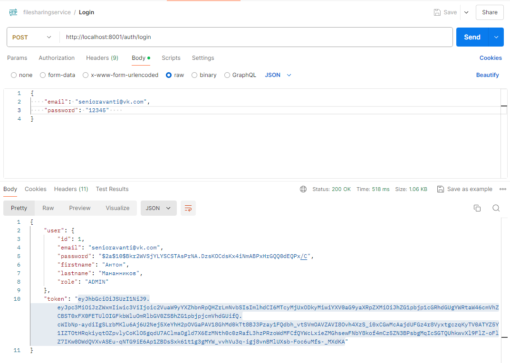
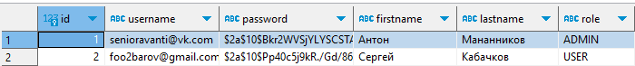
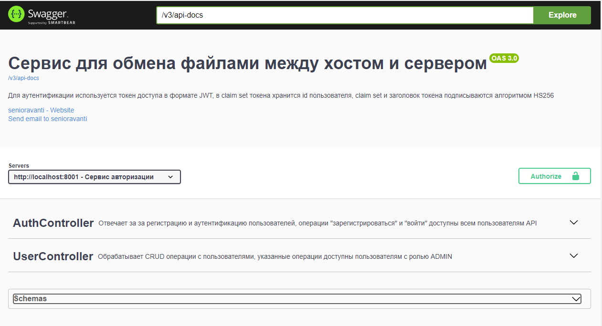

# Файлообменник на Java с исп. Spring Boot

## 1. Сервис авторизации

- Аутентификация по токенам доступа в формате JWT;

- Регистрация пользователя

- Swagger c доп настройкой добавления токена(закрытые запросы в сваггере выполнялись с токеном)
