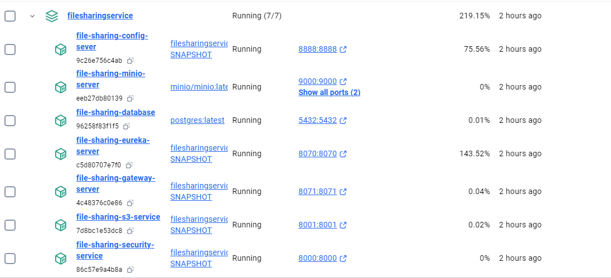
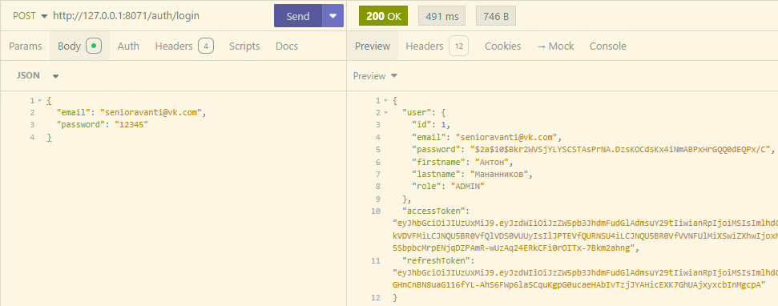
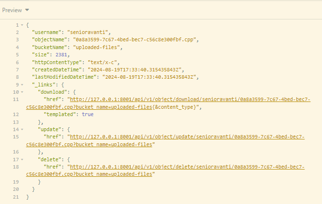
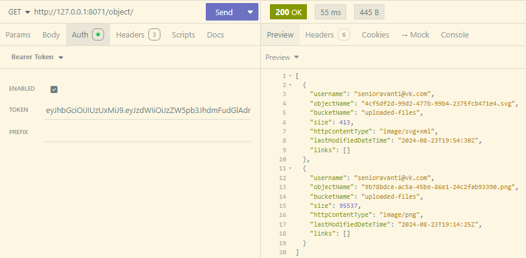
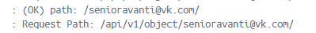
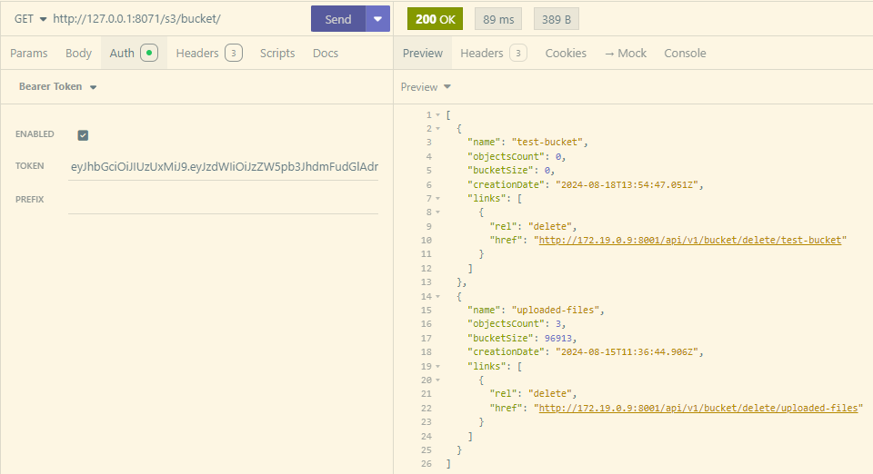

# Микросервис для работы с s3 совместимым объектным хранилищем Minio

 

Микросервис разработан на Java и работает под управлением фреймворка Spring. 

Microservice developed in Java, powered by Spring.

- Версия Java: 21;
- Версия Spring Boot: 3.4.2;
- Технологии: Docker, Minio, Maven, etc.

[Репозиторий с конфигурацией проекта](https://github.com/Antonio-Stradiavanti/spring-mvc-file-sharing-service-config.git)

## Развертывание

Для развертывания микросервиса необходимо определить следующие переменные среды (для некоторых из них определены значения по умолчанию):

- `MINIO_URI=http://localhost:9000` :: URL адрес сервера minio;

- `MINIO_ACCESS_KEY`, `MINIO_SECRET_KEY` :: Учетные данные пользователя для программного доступа к объектному хранилищу;

- `MAX_FILE_SIZE` :: ;
- `MAX_REQUEST_SIZE` :: ;

- `S3_SERVICE_PORT=8006` :: Порт, который будет прослушивать микросервис.

- `ALLOWED_ORIGINS` :: CORS. Последовательность URL адресов приложений, которым нужен доступ к объектному хранилищу. URL адерса разделяют запятыми.

- `CONFIG_SERVER_URI` :: URL-адрес сервера внешней конфигурации.

## Скриншоты

Список контейнеров

Ответ сервера на аутентификацию

Ответ сервера на загрузку файла в объектное хранилище

Получим список файлов, фильтр шлюза извлекает из полезной нагрузки (claims) токена claim subject, то есть имя пользователя и добавляет его к пути запроса.

Преобразованный путь:

Фильтры:

Список бакетов
